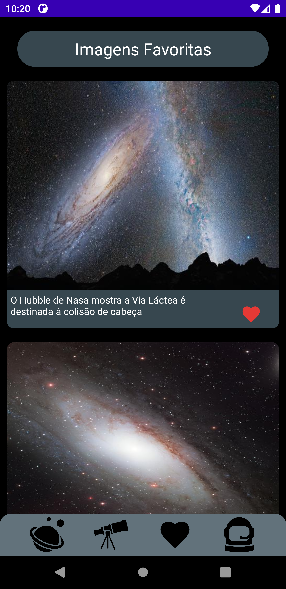
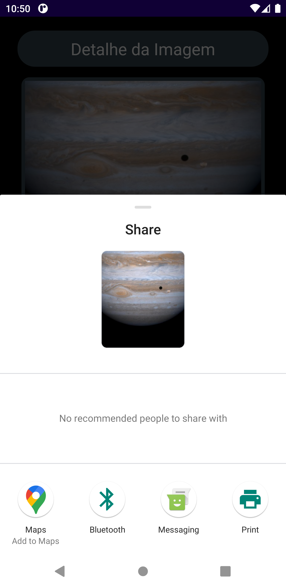

# NasaProjetoIntegrador
Aplicativo Desenvolvido para a prática da Linguagem Kotlin com o Tema NASA voltado para o público infantil com o intuito de levar um pouco sobre astronomia as crianças. 

Linguagem Kotlin utilizando:
- Retrofit, Courotines e Flow para consumir a API da NASA de modo exibir imagens do Sistema Solar;
- Aplicação da Arquiteura MVVM ao projeto utilizando viewModels;
- Banco de Dados com a biblioteca ROOM para armazenar as imagens favoritas;
- Firebase Authentication para Cadastro de Usuário e Autenticação de Login do Usuário;
- Firebase Realtime Database para atualização das informações dos planetas e para atualização do conteúdo das curiosidades do Sistema Solar;
- Firebase Storage para o armazenamneto do texto pesquisado pelo Usuário para encontrar as imagens da API da NASA;
- Firebase Cloud Messaging utilizado puh notification para os usuários do aplicativo;
- Tela de Abertura e demais Telas com animações utilizando a biblioteca Lottie;
- Shared Preferences para armazenar o nome e imagem do Avatar do Perfil do Astronauta; 

## TELA DE ABERTURA DO APLICATIVO

## TELA DE BOAS VINDAS

## TELA DE LOGIN

## TELA DE MENU PRINCIPAL

## TELA DE INFORMAÇÕES DOS PLANETAS

## TELA DE DETALHE DE CADA PLANETA

## TELA DE INFORMAÇÃO DO SISTEMA SOLAR

## TELA DE CURIOSIDADES

## TELA DE PESQUISA DE IMAGENS DA NASA

## TELA DAS IMAGENS ENCONTRADAS

## TELA DE IMAGENS FAVORITAS

## TELA DE DETALHE DA IMAGEM

### Salvando uma imagem

### Compartilhando uma imagem

## TELA DE PERFIL DO USUÁRIO

